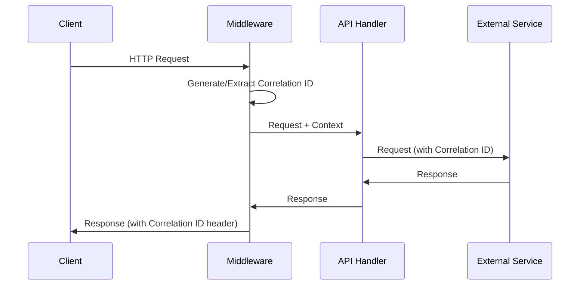

# Logging Guide: Structured Logging with Correlation IDs

## 🎯 **Overview**

The Izerwaren frontend implements enterprise-grade structured logging with correlation ID tracking for complete observability and traceability across all API operations.

## 📊 **Features**

### ✅ Implemented
- **Correlation ID Management**: Automatic generation and propagation
- **Structured Logging**: JSON format for production, pretty format for development
- **Performance Metrics**: Request/response timing and operation tracking
- **Request/Response Logging**: Complete HTTP request lifecycle tracking
- **Error Tracking**: Comprehensive error logging with stack traces
- **Security**: Automatic redaction of sensitive fields
- **Health Check Logging**: Detailed service health monitoring

### 🔄 Middleware Integration
- **Automatic**: All API routes use logging middleware
- **Headers**: Correlation IDs added to response headers
- **Context**: Request context preserved throughout operation

## 🏗️ **Architecture**

### Core Components

#### `src/lib/logger.ts`
```typescript
// Main logging service
export class StructuredLogger {
  debug(message: string, data?: any, context?: LogContext): void
  info(message: string, data?: any, context?: LogContext): void
  warn(message: string, data?: any, context?: LogContext): void
  error(message: string, error?: Error | any, context?: LogContext): void
  performance(metrics: PerformanceMetrics, context?: LogContext): void
  userAction(action: string, userId?: string, data?: any): void
  securityEvent(event: string, severity: 'low' | 'medium' | 'high' | 'critical'): void
  businessMetric(metric: string, value: number, unit?: string): void
}

// Correlation ID tracking
export class CorrelationIdManager {
  static generate(): string
  static set(correlationId: string): void
  static get(): string | undefined
  static getOrGenerate(): string
}

// Performance timing
export class PerformanceTimer {
  constructor(operation: string, logger: StructuredLogger)
  end(success: boolean = true, errorType?: string): number
}
```

#### `src/middleware/logging.ts`
```typescript
// Automatic logging for API routes
export function withRequestLogging(handler: Function): Function
export function withLogging(handler: Function): Function
export function getCurrentRequestContext(): { correlationId?: string }
```

## 🚀 **Usage Examples**

### Basic Logging
```typescript
import { createLogger } from '@/lib/logger';

const logger = createLogger({
  component: 'user-service',
  operation: 'create-user',
});

logger.info('Creating new user', { userId: '12345' });
logger.error('User creation failed', error, { userId: '12345' });
```

### API Route with Logging
```typescript
import { withRequestLogging } from '@/middleware/logging';
import { createLogger, createTimer } from '@/lib/logger';

async function handler(request: NextRequest) {
  const logger = createLogger({ component: 'api-products' });
  const timer = createTimer('fetch-products');
  
  try {
    logger.info('Fetching products');
    const products = await fetchProducts();
    timer.end(true);
    
    return NextResponse.json(products);
  } catch (error) {
    timer.end(false, error.name);
    logger.error('Failed to fetch products', error);
    throw error;
  }
}

export const GET = withRequestLogging(handler);
```

### Performance Tracking
```typescript
import { createTimer } from '@/lib/logger';

const timer = createTimer('database-query', { 
  query: 'SELECT * FROM products' 
});

try {
  const result = await executeQuery();
  timer.end(true);
  return result;
} catch (error) {
  timer.end(false, error.name);
  throw error;
}
```

### User Action Logging
```typescript
import { log } from '@/lib/logger';

// Track user actions
log.userAction('product-view', userId, { 
  productId: '12345',
  category: 'electronics',
  source: 'search'
});

log.userAction('purchase', userId, {
  orderId: '67890',
  amount: 299.99,
  currency: 'USD'
});
```

### Security Event Logging
```typescript
import { log } from '@/lib/logger';

// Track security events
log.securityEvent('failed-login', 'medium', {
  email: 'user@example.com',
  ip: '192.168.1.1',
  attempts: 3
});

log.securityEvent('unauthorized-access', 'high', {
  userId: '12345',
  resource: '/admin/users',
  action: 'DELETE'
});
```

### Business Metrics
```typescript
import { log } from '@/lib/logger';

// Track business metrics
log.businessMetric('revenue', 1250.00, 'USD');
log.businessMetric('orders-completed', 5, 'count');
log.businessMetric('page-load-time', 1.2, 'seconds');
```

## 📋 **Log Structure**

### Development Format
```
[2025-08-05T01:19:14.473Z] [INFO] [correlation-id] Message
  Details: {
    "data": { ... },
    "httpRequest": { ... },
    "error": { ... }
  }
```

### Production Format (JSON)
```json
{
  "timestamp": "2025-08-05T01:19:14.473Z",
  "level": "info",
  "service": "izerwaren-frontend",
  "version": "1.0.0",
  "environment": "production",
  "correlationId": "health-1754356754473-z1h6pb65w",
  "component": "api-middleware",
  "operation": "http-request",
  "message": "Request completed successfully",
  "httpResponse": {
    "status": 200,
    "duration": 157,
    "method": "GET",
    "url": "/api/health"
  }
}
```

## 🔧 **Configuration**

### Environment Variables
```bash
# Logging level (development)
NODE_ENV=development  # Enables pretty logging

# Production configuration
NODE_ENV=production   # Enables JSON structured logging
```

### Security Features
- **Automatic Redaction**: Sensitive fields are automatically redacted
- **Field Filtering**: `password`, `token`, `apiKey`, `secret`, `authorization`, `cookie`, `session`
- **PII Protection**: User data is carefully handled and can be filtered

## 📊 **Correlation ID Flow**



## 🔍 **Monitoring & Observability**

### Health Check Logging
- **Service Status**: Individual service health tracking
- **Performance Metrics**: Response times and error rates
- **Dependency Monitoring**: External service connectivity
- **System Resources**: Memory usage and uptime

### Log Levels
- **DEBUG**: Development debugging, verbose operation details
- **INFO**: Normal operations, request/response lifecycle
- **WARN**: Degraded performance, non-critical issues
- **ERROR**: Operation failures, exceptions
- **FATAL**: Critical system failures

### Searchable Fields
- `correlationId`: Request tracing
- `component`: Service component
- `operation`: Specific operation
- `userId`: User identification
- `httpRequest.method`: HTTP method
- `httpResponse.status`: Response status
- `level`: Log level

## 🎯 **Best Practices**

### Do's ✅
- **Always use correlation IDs** for request tracking
- **Include context** in log messages
- **Use appropriate log levels** for different scenarios
- **Track performance metrics** for critical operations
- **Log user actions** for analytics and debugging

### Don'ts ❌
- **Never log sensitive data** (passwords, tokens, personal data)
- **Avoid excessive DEBUG logging** in production
- **Don't log large payloads** that could impact performance
- **Don't use generic error messages** without context

### Performance Considerations
- **Async Logging**: Logs don't block operations
- **Structured Format**: Easy parsing and analysis
- **Minimal Overhead**: Lightweight logging implementation
- **Memory Efficient**: No accumulation of log data

## 🔗 **Integration Points**

### Current Integrations
- ✅ **Health Check Endpoints**: `/api/health/*`
- ✅ **API Middleware**: Automatic request/response logging
- ✅ **Error Handling**: Comprehensive error tracking

### Future Integrations
- 🔄 **Sentry Integration**: Error monitoring service
- 🔄 **GCP Cloud Logging**: Centralized log aggregation
- 🔄 **Grafana Dashboards**: Log visualization
- 🔄 **Alerting Rules**: Automated incident detection

## 📚 **Examples in Codebase**

### Health Check Implementation
See `src/app/api/health/route.ts` for comprehensive logging implementation:
- Service health monitoring
- Performance tracking
- Error handling
- Correlation ID management

### Middleware Implementation
See `src/middleware/logging.ts` for automatic request/response logging:
- Request context extraction
- Response enhancement
- Error capture
- Performance measurement

---

**Next Steps**: Ready to implement error monitoring and alerting (Task 3.3) to complement this logging foundation.