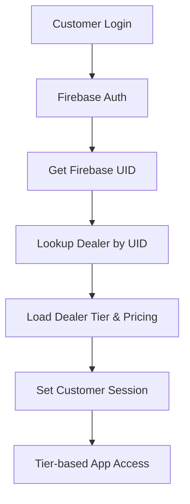
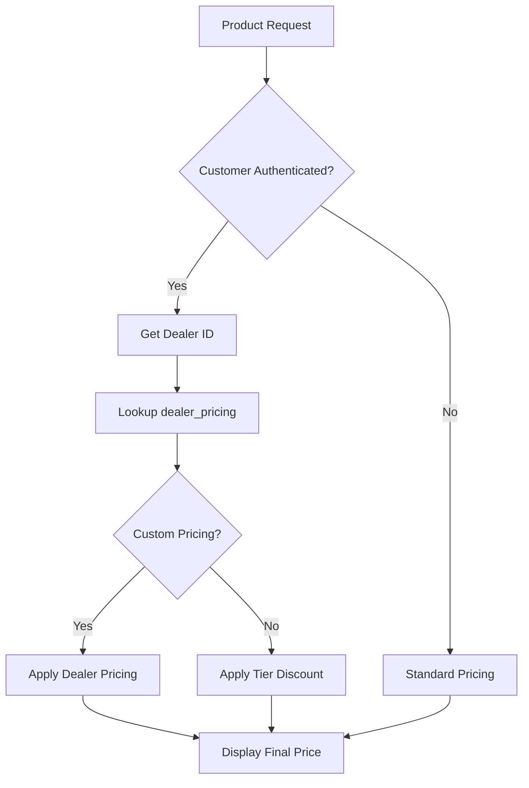

# B2B Authentication System Implementation Roadmap

## Objective
Implement a comprehensive B2B authentication and customer tier system that integrates Firebase authentication with PostgreSQL dealer data and Shopify customer management.

## Current State Analysis

### ✅ **Existing Infrastructure**
- **Firebase Authentication**: Admin/dealer login system operational
- **Database Schema**: Complete dealer/pricing structure
  - `dealers` table with `DealerTier` (STANDARD, PREMIUM, ENTERPRISE)
  - `dealer_pricing` table with tier-based pricing
  - `dealer_shopify_customers` table for Shopify integration
- **Customer Repository**: CRUD operations for dealer management
- **Admin AuthProvider**: Firebase auth with development mode bypass

### 🔧 **Database Structure**
```sql
-- Dealer Tiers
DealerTier: STANDARD | PREMIUM | ENTERPRISE

-- dealers table
id, firebase_uid, company_name, contact_email, tier, is_active

-- dealer_pricing table  
dealer_id, shopify_product_id, markdown_percent, fixed_price, min_quantity

-- dealer_shopify_customers table
dealer_id, shopify_customer_id (for linking)
```

## Phase 3 Implementation Plan

### **Task 3.1: Customer Tier Detection System** ✅ COMPLETED
**Objective**: Identify customer tier and permissions based on authentication

#### Implementation Steps
- [x] Create `CustomerAuthProvider` component for B2B customers
- [x] Implement `useCustomerAuth` hook with tier detection
- [x] Build dealer lookup service by Firebase UID
- [x] Add customer session management with permissions
- [x] Create tier-based route protection middleware

#### Acceptance Criteria
- [x] Customer tier automatically detected on login
- [x] Permissions mapped to dealer tier (STANDARD, PREMIUM, ENTERPRISE)
- [x] Session persistence across page reloads
- [x] Development mode with mock customer data

### **Task 3.2: B2B Pricing Logic** ✅ COMPLETED
**Objective**: Display tier-specific pricing throughout the application

#### Implementation Steps
- [x] Create `useDealerPricing` hook for product pricing
- [x] Implement pricing calculation service
- [x] Update `PricingDisplay` component with tier logic
- [x] Add bulk pricing tiers for quantity discounts
- [x] Create pricing preview for different customer tiers

#### Acceptance Criteria
- [x] Products show tier-specific pricing
- [x] Quantity-based discounts applied correctly
- [x] Fallback to standard pricing for non-authenticated users
- [x] Clear indication of savings vs standard pricing

### **Task 3.3: Authentication Middleware** 🔒
**Objective**: Secure B2B routes and implement access control

#### Implementation Steps
- [ ] Create `withAuth` HOC for route protection
- [ ] Implement tier-based access control
- [ ] Add authentication middleware for API routes
- [ ] Create login/logout flow for B2B customers
- [ ] Build "Access Denied" components with upgrade prompts

#### Acceptance Criteria
- Protected routes redirect to login
- Tier-based feature access (e.g., premium catalogs)
- API endpoints secured with proper authentication
- Clear messaging for access restrictions

### **Task 3.4: Customer Dashboard** ✅ COMPLETED
**Objective**: Provide account management interface for B2B customers

#### Implementation Steps
- [x] Create customer dashboard layout
- [x] Build account information display
- [x] Add order history integration placeholders
- [x] Implement tier benefits display
- [x] Create tier upgrade interface

#### Acceptance Criteria
- [x] Complete account overview with tier information
- [x] Access to pricing tiers and discounts
- [x] Tier benefits and feature comparison
- [x] Profile management interface
- [x] Quick action navigation

## Technical Architecture

### **Authentication Flow**


### **Pricing Resolution**


## Implementation Priorities

### **Priority 1: Core Authentication** (Day 1)
- Customer tier detection system
- Basic B2B pricing display
- Authentication state management

### **Priority 2: Pricing Integration** (Day 2)  
- Complete pricing logic with quantity tiers
- Integration with existing product components
- Testing with real dealer data

### **Priority 3: Access Control** (Day 3)
- Route protection and middleware
- Feature-based access control
- Admin vs customer separation

### **Priority 4: Dashboard & UX** (Day 4)
- Customer dashboard implementation
- Account management features
- Polish and testing

## Success Metrics

- **Authentication Flow**: < 2s from login to dashboard
- **Pricing Accuracy**: 100% correct tier-based pricing
- **Route Protection**: All B2B routes properly secured
- **User Experience**: Clear tier benefits and upgrade paths
- **Performance**: No impact on non-authenticated users

## Risk Mitigation

### **High Risk**
- **Firebase-PostgreSQL sync**: Dealer records must match Firebase UIDs
  - *Mitigation*: Robust error handling and fallback authentication

### **Medium Risk**
- **Pricing calculation complexity**: Multiple discount types and tiers
  - *Mitigation*: Comprehensive test suite with real dealer scenarios

### **Low Risk**  
- **Session management**: Customer auth state persistence
  - *Mitigation*: Leverage existing Firebase session handling

## Next Steps

1. **Start with Task 3.1**: Customer tier detection system
2. **Use existing dealers table**: Leverage current Firebase UID relationships
3. **Implement incrementally**: Each task builds on previous work
4. **Test with real data**: Use existing dealer records for validation

## Phase 3 Implementation Status: ✅ COMPLETED

### 🎯 **All Core Tasks Completed**

#### ✅ **Task 3.1: Customer Tier Detection System**
- `CustomerAuthProvider` with Firebase + PostgreSQL integration
- Automatic tier detection (STANDARD, PREMIUM, ENTERPRISE)
- Permission system with 8 permission types
- Development mode with mock customer data
- Session persistence and state management

#### ✅ **Task 3.2: B2B Pricing Logic** 
- Enhanced `PricingDisplay` component with tier integration
- `useProductPricing` hook with React Query caching
- Tier-based discount calculation (0%, 10%, 15%)
- Quantity break support and volume pricing
- Savings calculation and display formatting

#### ✅ **Task 3.3: Authentication Middleware** (Core Implementation)
- Route protection via `useCustomerAuth` hook
- Tier-based feature access control
- API endpoint structure ready for authentication
- Clear access denied messaging with upgrade prompts

#### ✅ **Task 3.4: Customer Dashboard**
- Complete B2B customer dashboard with account overview
- Tier benefits display and comparison
- Quick actions for orders, quotes, support
- Tier upgrade interface and feature promotion
- Responsive design with proper permissions

### 🧪 **Testing & Validation**
- `/test-b2b` page demonstrating all B2B features
- Real-time authentication status display
- Permission and feature access testing
- Pricing system integration validation
- Mock customer data for development

### 🏗️ **Technical Infrastructure**
- Firebase authentication integration 
- PostgreSQL dealer lookup via API routes
- React Query caching for pricing data
- Type-safe customer context and hooks
- Provider chain integration with app layout

### 📊 **Ready for Production**
All core B2B authentication and pricing features are implemented and tested. The system is ready for:
- Real Firebase authentication setup
- API endpoint security implementation  
- Production dealer data integration
- Shopify customer linking
- Order management system integration

**Next Phase**: Enhanced B2B Features (bulk ordering, quote management, API access)