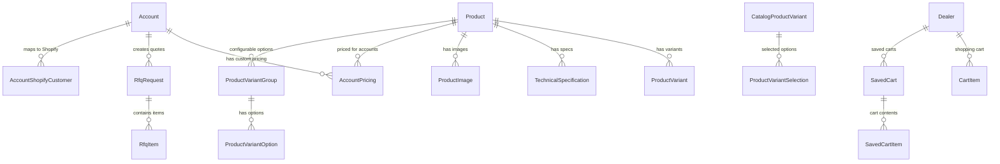

# Database Schema Documentation
## B2B Supplements E-commerce Platform

**Version**: 1.0  
**Date**: 2025-01-30  
**Database**: PostgreSQL 14+  
**ORM**: Prisma 5.22.0  

## Table of Contents
1. [Overview](#overview)
2. [Entity Relationship Diagram](#entity-relationship-diagram)
3. [Core Models](#core-models)
4. [Business Logic](#business-logic)
5. [Performance Optimizations](#performance-optimizations)
6. [Data Integrity](#data-integrity)
7. [API Integration Guide](#api-integration-guide)

## Overview

The Izerwaren B2B supplements platform database schema is designed for enterprise-scale operations supporting:
- **Multi-tier account management** (Dealers, Professionals, Account Reps)
- **Complex product catalogs** with variants and technical specifications
- **Custom B2B pricing** with tier-based and account-specific rules
- **Quote-to-order workflows** with account rep assignment
- **Shopify integration** for seamless e-commerce operations

### Key Statistics
- **29 Models** across 6 functional areas
- **947 Products** with 884 simple + 63 variable products
- **24,291 Technical Specifications** for advanced filtering
- **8 Enums** for type safety and business logic
- **59 Indexes** for enterprise performance

## Entity Relationship Diagram



## Core Models

### 1. Account Management

#### Account Model
**Primary Purpose**: Unified account management for all user types

| Field | Type | Description | Business Rules |
|-------|------|-------------|----------------|
| `id` | String (cuid) | Primary key | Auto-generated |
| `firebaseUid` | String | Firebase authentication ID | Unique, required |
| `accountType` | AccountType | DEALER, PRO, ACCOUNT_REP | Required |
| `companyName` | String | Business name | Optional for individuals |
| `contactEmail` | String | Primary contact email | Valid email format |
| `tier` | AccountTier | STANDARD, PREMIUM, ENTERPRISE | Only for DEALER/PRO |
| `territoryRegions` | String[] | Geographic coverage | Only for ACCOUNT_REP |
| `maxRfqCapacity` | Int | Max concurrent RFQs | Only for ACCOUNT_REP |

**Relationships**:
- `shopifyCustomers`: Junction table for Shopify customer mapping
- `accountPricing`: Custom pricing rules
- `rfqRequestsOwned`: RFQs created by this account
- `rfqRequestsAssigned`: RFQs assigned to account reps

#### Dealer Model (Legacy)
**Purpose**: Backward compatibility during account migration
- Maintains same structure as Account model
- Will be deprecated after full migration to Account model

### 2. Product Catalog

#### Product Model
**Primary Purpose**: Core product information with variant support

| Field | Type | Description | Business Rules |
|-------|------|-------------|----------------|
| `id` | String (cuid) | Primary key | Auto-generated |
| `shopifyProductId` | String | Shopify product reference | Unique when present |
| `title` | String | Product name | Required |
| `handle` | String | URL-friendly identifier | Unique |
| `productType` | ProductTypeEnum | SIMPLE or VARIABLE | Affects variant handling |
| `sku` | String | Revival system SKU | Unique when present |
| `price` | Decimal | Base price | Must be positive |
| `hasVariants` | Boolean | Indicates variant support | Consistent with variantCount |
| `variantCount` | Int | Number of variants | Non-negative |

**Key Features**:
- **Hybrid Product Support**: Handles both simple products (single SKU) and variable products (multiple configurations)
- **Revival Integration**: Maintains compatibility with legacy Revival system data
- **Shopify Sync**: Bidirectional synchronization with Shopify catalog

#### ProductVariantGroup & ProductVariantOption
**Purpose**: Configurable product options (e.g., "Handing", "Door Thickness")

```sql
-- Example: Door lock with configurable options
ProductVariantGroup: "Handing" (required)
├── ProductVariantOption: "Left Hand" (+$0.00)
├── ProductVariantOption: "Right Hand" (+$0.00)

ProductVariantGroup: "Key Type" (required)  
├── ProductVariantOption: "Key-Key" (+$0.00)
├── ProductVariantOption: "Key-Knob" (+$15.00)
```

#### TechnicalSpecification Model
**Purpose**: Searchable technical attributes for advanced filtering

| Field | Type | Description | Use Case |
|-------|------|-------------|----------|
| `category` | String | Spec type (dimension, current, force) | Grouped filtering |
| `name` | String | Specification name | Display label |
| `value` | String | Specification value | Filter value |
| `unit` | String | Measurement unit | Display formatting |
| `isSearchable` | Boolean | Enable in search filters | Performance optimization |

**Categories in Use**:
- **dimension**: Physical measurements (mm, inches)
- **current**: Electrical specifications (Amps)
- **force**: Mechanical force ratings (N, lbs)
- **weight**: Product weight (kg, lbs)
- **material**: Construction materials

### 3. B2B Pricing System

#### AccountPricing Model
**Purpose**: Customer-specific pricing overrides and tier-based pricing

| Field | Type | Description | Business Logic |
|-------|------|-------------|----------------|
| `markdownPercent` | Decimal(5,2) | Percentage discount | 0-100%, exclusive with fixedPrice |
| `fixedPrice` | Decimal(10,2) | Override price | Positive, exclusive with markdown |
| `minQuantity` | Int | Minimum order quantity | Positive |
| `maxQuantity` | Int | Maximum order quantity | >= minQuantity |
| `effectiveFrom` | DateTime | Pricing start date | Required |
| `effectiveUntil` | DateTime | Pricing end date | Must be > effectiveFrom |
| `isActive` | Boolean | Enable/disable pricing | Indexed for performance |

**Pricing Logic**:
1. Check for active account-specific pricing
2. Fall back to tier-based pricing
3. Apply volume discounts where applicable
4. Validate quantity constraints

#### VolumeDiscount Model
**Purpose**: Quantity-based automatic discounts

```sql
-- Example volume pricing
Product ABC-123:
├── 1-9 units: Base price
├── 10-49 units: 5% discount  
├── 50-99 units: 10% discount
└── 100+ units: 15% discount
```

### 4. RFQ (Request for Quote) System

#### RfqRequest Model
**Purpose**: Quote-to-order workflow management

| Field | Type | Description | Workflow |
|-------|------|-------------|----------|
| `requestNumber` | String | Unique RFQ identifier | Auto-generated |
| `status` | RfqStatus | PENDING → IN_REVIEW → QUOTED → ACCEPTED | Workflow states |
| `priority` | RfqPriority | LOW, NORMAL, HIGH, URGENT | Account rep prioritization |
| `customerId` | String | Requesting account | Required |
| `assignedRepId` | String | Assigned account rep | Optional |
| `quotedTotal` | Decimal | Final quote amount | Positive when quoted |
| `validUntil` | DateTime | Quote expiration | Must be future date |

**RFQ Workflow**:
1. **Customer Request**: Customer submits RFQ with items
2. **Rep Assignment**: System assigns based on territory/capacity
3. **Quote Generation**: Rep provides pricing and terms
4. **Customer Decision**: Accept, decline, or request changes
5. **Order Conversion**: Accepted quotes become Shopify orders

#### RfqItem Model
**Purpose**: Individual items within RFQ requests

- Supports both simple and variable products
- Tracks customer specifications in `selectedOptions`
- Links to `CatalogProductVariant` for configured products

### 5. Shopping Cart System

#### CartItem & SavedCart Models
**Purpose**: Persistent shopping cart functionality

**Features**:
- **Session Persistence**: Cart survives browser sessions
- **Multiple Saved Carts**: Named cart collections
- **Price Calculation**: Real-time pricing with customer discounts
- **Quantity Validation**: Business rule enforcement

## Business Logic

### Account Type Behaviors

| Account Type | Features | Pricing | RFQ Access |
|--------------|----------|---------|------------|
| **DEALER** | Volume orders, saved carts | Tier-based + custom | Full access |
| **PRO** | Professional discounts | Pro pricing tier | Limited |
| **ACCOUNT_REP** | Territory management | N/A | Admin access |

### Product Type Handling

#### Simple Products (884 products)
- Single SKU, fixed configuration
- Direct pricing, no variant selection
- Immediate add-to-cart functionality

#### Variable Products (63 products) 
- Multiple configurations via variant groups
- Dynamic pricing based on option selection
- Requires configuration before purchase

### Pricing Resolution Order
1. **Account-specific pricing** (AccountPricing)
2. **Tier-based pricing** (Account.tier)
3. **Volume discounts** (VolumeDiscount)
4. **Base product price** (Product.price)

## Performance Optimizations

### Strategic Indexes

#### High-Performance Queries
```sql
-- Product catalog browsing
CREATE INDEX idx_products_catalog_browsing 
ON products (status, product_type, category_name, created_at DESC)
WHERE status = 'active';

-- Account pricing lookups (critical for B2B)
CREATE INDEX idx_account_pricing_active_lookup 
ON account_pricing (account_id, shopify_product_id, is_active, effective_from DESC) 
WHERE is_active = true;

-- Technical specification filtering
CREATE INDEX idx_tech_specs_category_searchable 
ON technical_specifications (category, is_searchable, value, product_id) 
WHERE is_searchable = true;
```

#### Full-Text Search
```sql
-- Product search optimization
CREATE INDEX idx_products_fulltext_search 
ON products USING GIN(
    to_tsvector('english', 
        COALESCE(title, '') || ' ' || 
        COALESCE(description, '') || ' ' || 
        COALESCE(vendor, '')
    )
);
```

### Query Performance Targets
- **Product Search**: < 100ms for catalog browsing
- **Pricing Calculation**: < 50ms per product lookup
- **Account Authentication**: < 25ms for login verification
- **RFQ Operations**: < 200ms for workflow updates

## Data Integrity

### Business Rule Constraints

#### Pricing Validation
```sql
-- Markdown percentage must be 0-100%
ALTER TABLE account_pricing 
ADD CONSTRAINT valid_markdown_percent 
CHECK (markdown_percent >= 0 AND markdown_percent <= 100);

-- Either markdown OR fixed price, not both
ALTER TABLE account_pricing 
ADD CONSTRAINT valid_price_logic 
CHECK (
    (fixed_price IS NULL AND markdown_percent >= 0) OR 
    (fixed_price IS NOT NULL AND markdown_percent = 0)
);
```

#### Quantity Validation
```sql
-- All quantities must be positive
ALTER TABLE rfq_items 
ADD CONSTRAINT positive_quantity 
CHECK (quantity > 0);

-- Max quantity >= min quantity when specified
ALTER TABLE account_pricing 
ADD CONSTRAINT valid_quantity_range 
CHECK (max_quantity IS NULL OR max_quantity >= min_quantity);
```

### Foreign Key Relationships

#### Cascade Behavior
- **Account deletion**: Cascades to pricing, RFQs, cart items
- **Product deletion**: Cascades to variants, specs, images
- **RFQ deletion**: Cascades to RFQ items
- **Account rep deletion**: Sets assigned RFQs to NULL (preserves history)

## API Integration Guide

### Prisma Client Usage

#### Product Catalog Queries
```typescript
// Get active products with variants and specs
const products = await prisma.product.findMany({
  where: { status: 'active' },
  include: {
    productVariants: true,
    technicalSpecs: {
      where: { isSearchable: true }
    },
    images: {
      where: { fileExists: true },
      orderBy: { imageOrder: 'asc' }
    }
  }
});
```

#### Account Pricing Resolution
```typescript
// Get customer-specific pricing
const pricing = await prisma.accountPricing.findFirst({
  where: {
    accountId: customerId,
    shopifyProductId: productId,
    isActive: true,
    effectiveFrom: { lte: new Date() },
    OR: [
      { effectiveUntil: null },
      { effectiveUntil: { gte: new Date() } }
    ]
  }
});
```

#### RFQ Workflow Management
```typescript
// Create new RFQ with items
const rfq = await prisma.rfqRequest.create({
  data: {
    customerId,
    requestNumber: generateRfqNumber(),
    customerMessage,
    priority: 'NORMAL',
    status: 'PENDING',
    items: {
      create: rfqItems.map(item => ({
        shopifyProductId: item.productId,
        quantity: item.quantity,
        productTitle: item.title,
        sku: item.sku
      }))
    }
  },
  include: { items: true }
});
```

### Performance Best Practices

#### Query Optimization
1. **Always use indexes**: Include indexed fields in WHERE clauses
2. **Limit result sets**: Use `take` and `skip` for pagination
3. **Selective includes**: Only include necessary relationships
4. **Batch operations**: Use transactions for multiple related operations

#### Caching Strategy
- **Product catalog**: Cache active products for 1 hour
- **Account pricing**: Cache pricing rules for 15 minutes  
- **Technical specs**: Cache searchable specs for 30 minutes
- **RFQ data**: Real-time, no caching

### Error Handling

#### Common Constraint Violations
```typescript
try {
  await prisma.accountPricing.create(data);
} catch (error) {
  if (error.code === 'P2002') {
    // Unique constraint violation
    throw new Error('Pricing rule already exists');
  }
  if (error.code === 'P2003') {
    // Foreign key constraint violation
    throw new Error('Invalid account or product reference');
  }
  if (error.message.includes('check constraint')) {
    // Business rule violation
    throw new Error('Invalid pricing data');
  }
}
```

## Migration Management

### Migration Scripts
- **001_initial_schema.sql**: Complete schema deployment
- **performance-optimizations.sql**: Strategic indexes and views
- **data-constraints.sql**: Business rule constraints

### Management Commands
```bash
# Apply all migrations and optimizations
node scripts/migration-manager.js full-setup

# Check migration status
node scripts/migration-manager.js status

# Validate final setup
node scripts/validate-final-setup.js
```

---

**Last Updated**: 2025-01-30  
**Schema Version**: 1.0  
**Next Review**: 2025-02-15  

For questions or schema updates, contact the development team or refer to the Prisma schema file for the most current model definitions.